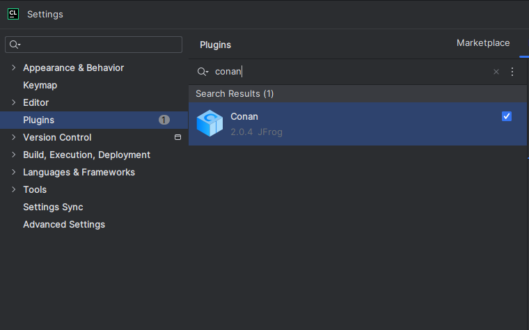
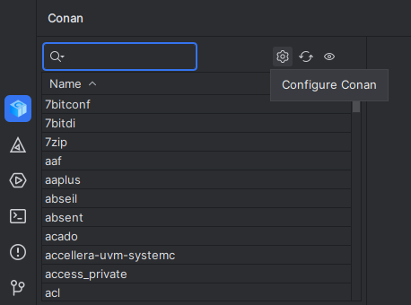
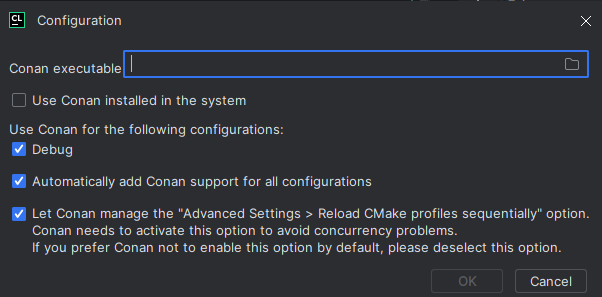

# Building (for Clion)

## 1. Clone rep
```
git clone 
```

## 2. Install conan
```
pip install conan
```

## 3. Install conan plugin in Clion



## 4. Configure Conan


### Find path of Conan and paste in plugin configuration
```
where conan
```

